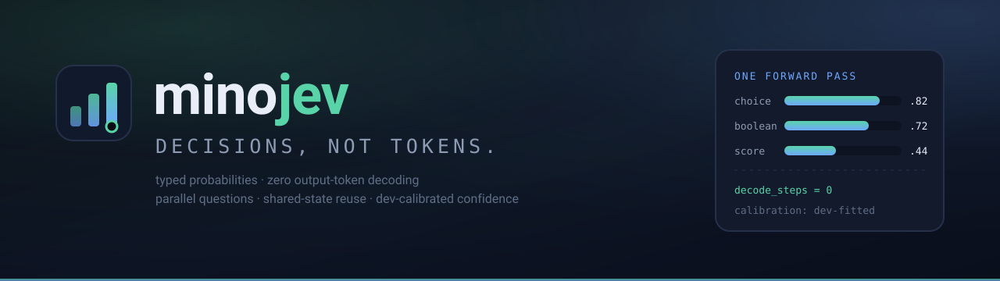
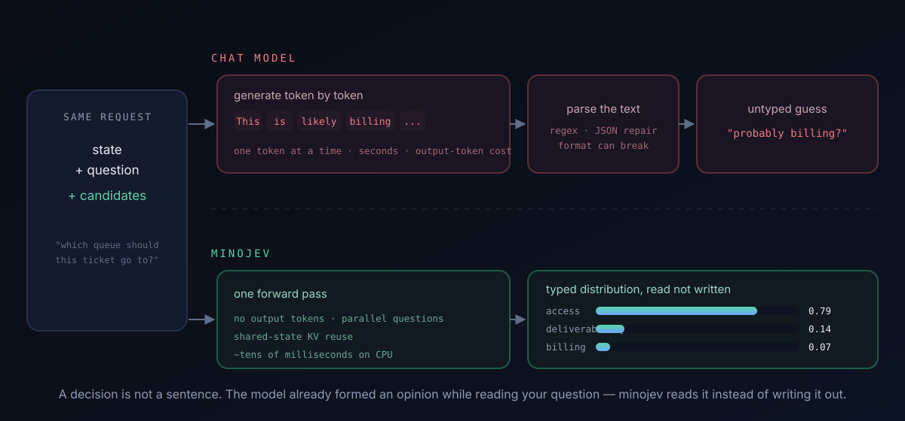

<p align="center"></p>

<p align="center">
  <a href="README.zh-CN.md">简体中文</a> · <b>English</b> · <a href="https://zeredy879.github.io/minojev/">Live demos</a> · <a href="https://huggingface.co/zeredy879/minojev">Models</a> · <a href="https://huggingface.co/datasets/zeredy879/minojev-data">Data</a>
</p>

<p align="center">
  <a href="https://huggingface.co/zeredy879/minojev"></a>
  <a href="https://huggingface.co/datasets/zeredy879/minojev-data"></a>
  
  
  
</p>

> **The one-sentence version.** A chat model answers by *writing* text; minojev
> answers by *reading* probabilities — so software gets a decision in one pass,
> with no sentence to parse and no output tokens to pay for.

## Start here (no ML background needed)

Imagine you ask an AI: **"Which queue should this support ticket go to?"**

A chat model answers with a sentence:

> *"Based on the customer's message, this looks like an access issue, so I would
> route it to the account access team."*

Now your program has to read that sentence and guess what it meant. That costs
time (the model writes word by word), money (you pay for every written word),
and luck (the wording can change, drift, or break your parser).

minojev throws away the sentence and keeps only the decision:

```
"Which queue?" ──►  access 0.79 · deliverability 0.14 · billing 0.07
```

One read of the input, one batch of numbers out. The numbers form a real
probability distribution, calibrated so 0.79 means close to "79% likely", and
every record says `decode_steps: 0` because nothing was ever written.



### A 30-second glossary

| Word | Plain meaning |
|---|---|
| **token** | a small piece of text; chat models produce them one at a time |
| **forward pass** | one trip through the model; minojev needs exactly one |
| **calibrated** | if it says 0.8, it should be right about 80% of the time — we measure the gap (ECE) and report it |
| **choice / boolean / score** | pick one of N options / yes–no / rate on a scale |

### Try it right now (no install)

Open the **[live demos](https://zeredy879.github.io/minojev/)**:

- **[Maze agent](https://zeredy879.github.io/minojev/maze.html)** — watch the
  model steer an agent through a grid while every step shows its move
  distribution and four parallel safety judgments.
- **[Decision console](https://zeredy879.github.io/minojev/console.html)** —
  one state, many questions scored together with their teacher distributions.

## What makes minojev different

| | A chat model | minojev |
|---|---|---|
| What comes out | a sentence to parse | a typed distribution over declared candidates |
| Where the answer comes from | token-by-token writing | read from hidden states, zero output tokens |
| What you pay for | output tokens | one forward pass |
| Broken output | possible | impossible — the output space is declared up front |
| Confidence | self-reported, often overconfident | fitted on held-out data; ECE measured |
| Many questions, one state | one generation each | one pass, shared KV prefix |
| Where it runs | GPU cluster or API | a laptop CPU; Hugging Face backbones optional |

What sets **this** project apart from other decision-model experiments:

- **Fully offline reproduction.** The bundled 547k-parameter models train from
  scratch on CPU in minutes. No downloads, no API keys, no GPU.
- **Every claim has an artifact.** Datasets, teacher targets, per-question
  predictions, metrics, and replay bundles are committed in the repo.
- **Calibration is first-class.** `--calibrate gold` is the default, because a
  probability you cannot trust is worse than a plain label.
- **Two engines.** Trained decision heads for full control, plus a
  native-logits route for pretrained Hugging Face models.
- **Bilingual and visual.** English + 简体中文 docs, an animated maze agent, and
  an interactive decision console.

## Install

```bash
uv venv --python 3.12 .venv && . .venv/bin/activate
uv pip install -e ".[test]"
# optional: Hugging Face backbones for the native-logits engine
uv pip install -e ".[hf]"
```

## Quick start

```bash
# 1. generate synthetic decision data (attribute lookup, comparison, support)
minojev synth --out data/train.jsonl --count 512 --seed 17 --split train
minojev synth --out data/dev.jsonl   --count 128 --seed 17 --split dev

# 2. train + calibrate in one command
minojev train --train data/train.jsonl --dev data/dev.jsonl \
  --output-dir runs/synth --steps 800 --head-steps 30 --eval-every 100 \
  --calibrate gold --device cpu

# 3. score arbitrary requests
minojev score --checkpoint runs/synth/checkpoint --input examples/decisions.jsonl \
  --output results/example-scores.jsonl --mode reuse
```

Train the maze agent and export a replay bundle:

```bash
minojev maze-data --out data/maze-train.jsonl --count 1024 --seed 17 --split train
minojev train --train data/maze-train.jsonl --dev data/maze-dev.jsonl \
  --output-dir runs/maze --steps 1500 --head-steps 40 --eval-every 100 --device cpu
minojev maze-rollout --checkpoint runs/maze/checkpoint \
  --output web/data/maze.json --count 6 --seed 23
```

## Calibration: confidence that means something

Training minimizes distribution loss, which does not by itself make confidence
meaningful. `minojev calibrate` fits one temperature per primitive on a dev
split, stores it in the checkpoint, and applies it at serving time. A positive
temperature never changes the predicted candidate — only how much the model
believes it.

| Bundled run | Accuracy | ECE before | ECE after | Mean confidence |
|---|---:|---:|---:|---:|
| Attribute decisions | 66.5% | 0.093 | **0.074** | 0.72 |
| Maze decisions | 83.8% | 0.090 | **0.016** | 0.84 |

```bash
minojev calibrate --checkpoint runs/synth/checkpoint --input data/dev.jsonl \
  --output runs/synth-calibrated --target gold
minojev evaluate  --checkpoint runs/synth-calibrated --input data/test.jsonl
```

## Results

Both bundled models are 547k-parameter transformers trained from scratch on
CPU. "Teacher top-set" counts a decision as correct when the prediction is
among the teacher's best — important for grid moves, where two directions
often tie. Regenerate everything with `scripts/build_results.sh`.

| Run | Questions | Accuracy | Teacher top-set | Dist. error | Decode steps |
|---|---:|---:|---:|---:|---:|
| Attribute decisions | 627 | 66.5% | 66.5% | 0.29 | 0 |
| Maze decisions | 1,536 | 83.8% | 89.5% | 0.13 | 0 |

Maze per-primitive top-set accuracy: **boolean safety 87.8%**, **distance
score 97.7%**, **move choice 87.9%**.

### Latency and throughput (laptop CPU, 547k params)

| Run | Mode | p50 | p95 | Decisions/s |
|---|---|---:|---:|---:|
| Attribute | fresh | 13.1 ms | 16.3 ms | 198 |
| Attribute | reuse | **11.8 ms** | **14.7 ms** | **233** |
| Maze | fresh | 23.6 ms | 27.0 ms | 198 |
| Maze | reuse | **17.1 ms** | **18.0 ms** | **366** |

One decision is one question; a request may carry several. Reproduce with
`minojev bench`. Raw metrics and per-question predictions are committed under
[`results/`](results); replay bundles live in [`web/data/`](web/data).

## Models and datasets on Hugging Face

- Checkpoints (trained + calibrated): [`zeredy879/minojev`](https://huggingface.co/zeredy879/minojev)
- Request datasets with teacher distributions: [`zeredy879/minojev-data`](https://huggingface.co/datasets/zeredy879/minojev-data)

```python
from huggingface_hub import snapshot_download
from minojev import DecisionModel

path = snapshot_download("zeredy879/minojev", allow_patterns=["maze/*"])
model = DecisionModel.load(f"{path}/maze", device="cpu")

data = snapshot_download("zeredy879/minojev-data", repo_type="dataset")
# data/maze/test.jsonl, data/synth/test.jsonl, ...
```

## Request format

```json
{
  "id": "route-1",
  "state": "Customer cannot access an account after a password reset.",
  "questions": {
    "queue": {
      "type": "choice",
      "instructions": "Which queue should handle this request?",
      "options": {"access": "Account access support.", "billing": "Billing support."}
    },
    "urgent": {
      "type": "boolean",
      "instructions": "Is the customer fully locked out?",
      "criteria": {"true": "No usable login path", "false": "Login path still works"}
    },
    "confidence": {
      "type": "score",
      "instructions": "How confident is this judgment?",
      "levels": ["very low", "low", "medium", "high", "very high"]
    }
  }
}
```

`state` may be text or JSON. Flat single-question rows
(`{"id", "state", "question", "options"}`) are accepted as choice questions.
Question ids identify responses and are never placed in the model input.
Optional `gold` and `teacher` maps enable evaluation and supervised training.

## Python API

```python
from minojev import DecisionModel, Request, make_choice_question, ScoreOptions

model = DecisionModel.load("runs/synth-calibrated", device="cpu")
request = Request(
    id="r1",
    state={"color": "blue", "shape": "round"},
    questions=[make_choice_question("q", "Which value belongs to 'shape'?",
                                    {"round": "round", "blue": "blue", "tiny": "tiny"})],
)
record = model.score([request], ScoreOptions(mode="reuse"))[0]
print(record["candidate_ids"], record["probabilities"], record["decode_steps"])
```

## Native-logits engine (pretrained models)

For a pretrained Hugging Face causal LM, `minojev.logits` scores declared
options directly from next-token logits at fixed answer-slot tokens. A
two-stage route scores each candidate independently (yes/no log-odds, then
normalization) for candidate sets beyond the 16 letter slots:

```python
from minojev import load_hf_backbone
from minojev.data import read_requests
from minojev.logits import score_logits, score_logits_two_stage

backbone = load_hf_backbone("Qwen/Qwen2.5-0.5B-Instruct")
requests = read_requests("examples/decisions.jsonl")
records = score_logits(backbone, backbone.tokenizer, requests)
wide = score_logits_two_stage(backbone, backbone.tokenizer, requests)
```

## Repository layout

```
src/minojev/
  types.py       request validation and primitives
  encoding.py    candidate paths, shared state/suffix split
  backbone.py    TinyLM (RoPE + KV cache) and HF adapter
  heads.py       scalar scorer + set attention, primitive readouts
  calibrate.py   temperature scaling per primitive
  model.py       serving modes, checkpoints
  train.py       warmup, objectives, dev selection
  synth.py       attribute decision families
  maze.py        grid-world states, teachers, agent rollout
  logits.py      native-logits readout (single-pass and two-stage)
  bench.py       latency and throughput measurement
  metrics.py     accuracy, CE, ECE, per-family splits
  cli.py         synth / train / calibrate / bench / score / evaluate / demo / maze
tests/           41 tests: contract, equivalence, calibration, training, maze, CLI
web/             landing page, decision console, maze replay
assets/          banner, logo, explainer
```

## Tests

```bash
.venv/bin/python -m pytest tests -q
```

The suite covers validation limits, path encoding, permutation equivariance,
boolean and score readouts, fresh-vs-reuse equivalence, batch independence,
checkpoint round trips, calibration invariance and fitting, expected
calibration error, an end-to-end training convergence check, the maze task and
rollout mechanics, benchmarking, the CLI, and both native-logits routes. It
runs offline on CPU in a few minutes.

## License

MIT — see [LICENSE](LICENSE).
